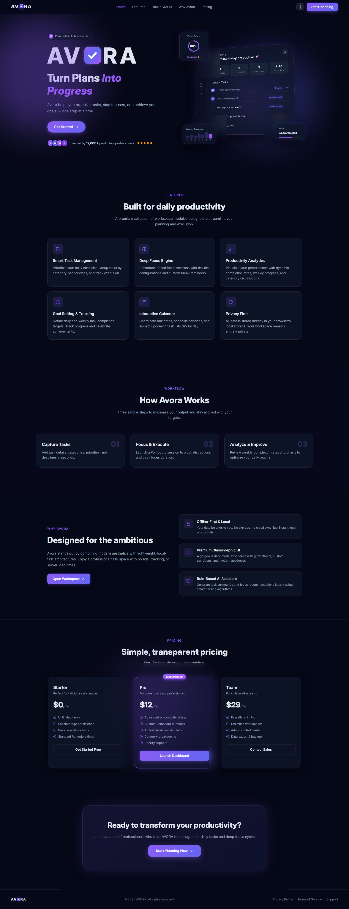
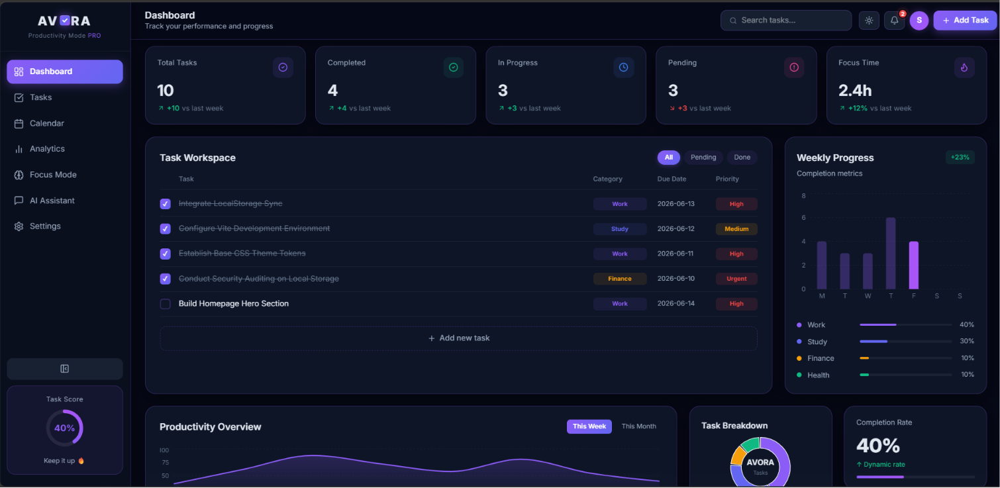
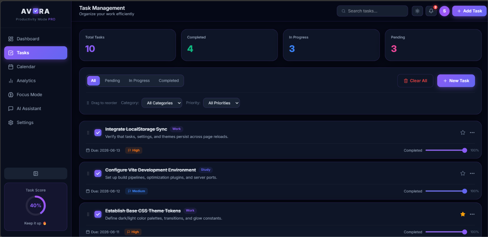
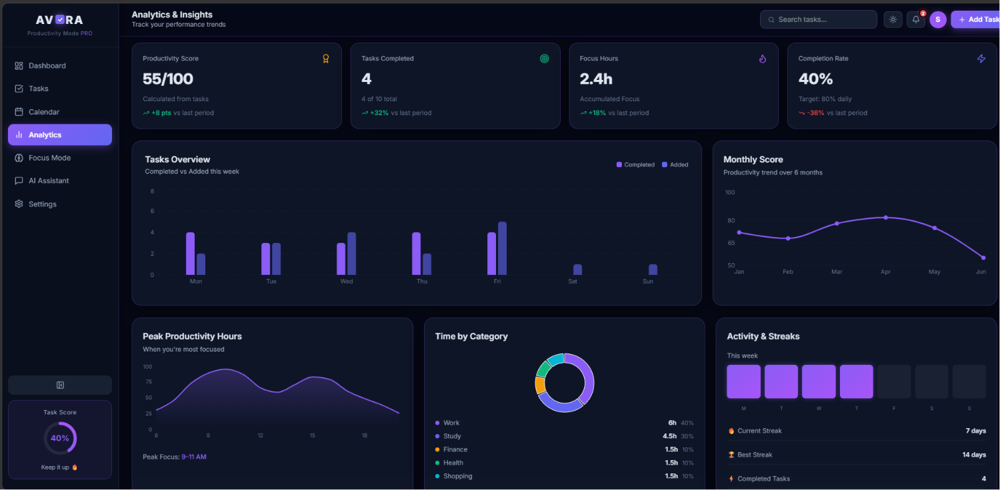
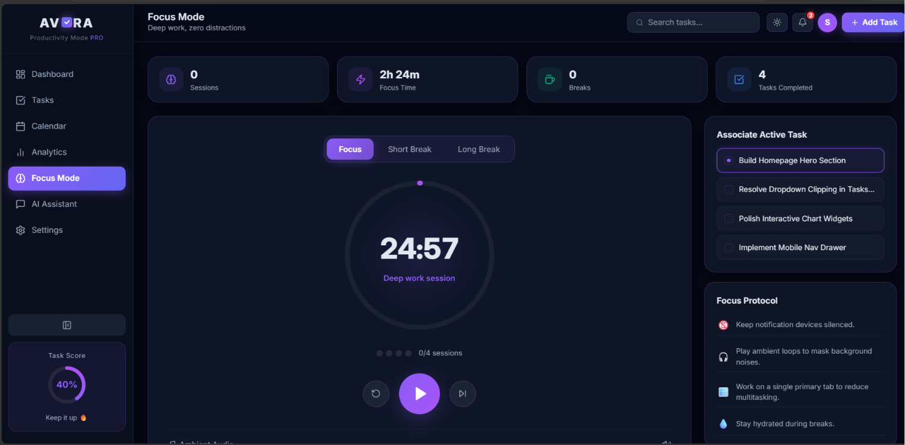
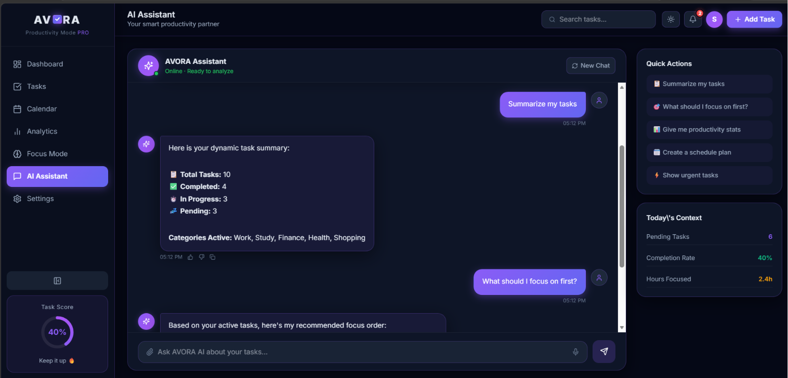
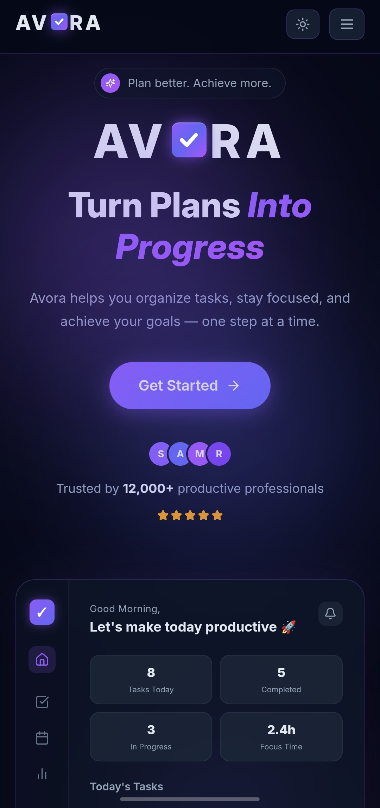

# 🚀 AVORA – Turn Plans Into Progress

AVORA is a modern productivity and task management web application designed to help users organize tasks, track goals, improve focus, and monitor productivity through an elegant and intuitive interface.

The application combines task management, analytics, focus sessions, calendar planning, and AI-powered productivity assistance into a single platform. Built with a responsive design, AVORA delivers a seamless experience across desktop, tablet, and mobile devices.

<!--  -->

## 🌟 Project Overview

AVORA helps users:

- Organize and manage daily tasks
- Track productivity and completion rates
- Schedule activities through an integrated calendar
- Improve concentration using Pomodoro-based Focus Mode
- Analyze productivity trends through visual dashboards
- Receive intelligent task recommendations from the AI Assistant

The project was developed as part of a technical assessment for the Junior Website Developer role.

---

## ✨ Features

### 📝 Task Management

- Create, edit, delete, and update tasks
- Task categorization
- Priority management
- Due date tracking
- Task completion status
- Real-time search and filters
- Drag & Drop task reordering
- Local Storage persistence
- Task progress tracking
- Clear All Tasks functionality

### 🔔 Notification Center

- Notification drawer
- Task created notifications
- Task completed notifications
- Due tomorrow reminders
- Overdue task alerts
- Mark as read
- Mark all as read
- Clear notifications
- Browser notification support

### 📊 Productivity Dashboard

- Dynamic task statistics
- Completion percentage
- Productivity score
- Focus time tracking
- Live updates from task changes

### 📅 Calendar Planner

- Monthly calendar view
- Task scheduling
- Upcoming events tracking
- Date-based task management

### 🤖 AI Productivity Assistant

- Smart task summaries
- Urgent task recommendations
- Daily productivity insights
- Goal tracking suggestions
- Frontend AI simulation

### 🎯 Focus Mode

- Pomodoro timer
- Focus sessions
- Short breaks
- Long breaks
- Session tracking

### 📈 Analytics

- Productivity score tracking
- Task completion trends
- Category-based analytics
- Weekly and monthly insights

### 🎨 Modern UI/UX

- Fully responsive design
- Dark and light theme support
- Glassmorphism-inspired interface
- Smooth animations and transitions
- Mobile-first optimization

### ⚙️ Settings

- Dark / Light / System theme
- Productivity goals
- User preferences persistence

---

## 📸 Screenshots

### Landing Page



### Dashboard



### Task Management



### Analytics



### Focus Mode



### AI Assistant



### Mobile Responsive



---

## 🛠 Tech Stack

### Frontend

- React.js
- TypeScript
- Vite

### Styling

- Tailwind CSS
- Framer Motion

### Routing

- React Router

### Charts & Analytics

- Recharts

### Icons

- Lucide React

### State Management

- React Context API

### Data Storage

- Local Storage

### Notifications

- Browser Notification API

### Deployment

- Netlify

---

## 📂 Project Structure

```bash
src/
│
├── app/
│   ├── components/
│   │   ├── Dashboard.tsx
│   │   ├── TaskManagement.tsx
│   │   ├── CalendarPage.tsx
│   │   ├── Analytics.tsx
│   │   ├── FocusMode.tsx
│   │   ├── AIAssistant.tsx
│   │   ├── SettingsPage.tsx
│   │   └── LandingPage.tsx
│   │
│   ├── App.tsx
│   └── routes.tsx
│
├── styles/
├── main.tsx
└── vite.config.ts
```

---

## ⚙️ Installation Steps

### 1. Clone the Repository

```bash
git clone https://github.com/Sandhya175/AVORA.git
```

### 2. Navigate to Project Directory

```bash
cd avora
```

### 3. Install Dependencies

```bash
npm install
```

---

## ▶️ Running Locally

Start the development server:

```bash
npm run dev
```

Open your browser and visit:

```bash
http://localhost:5173
```

---

## 📦 Build for Production

```bash
npm run build
```

Preview production build:

```bash
npm run preview
```

---

## 🌐 Live Demo

🔗 Live Application:
https://avora-productivity-app.netlify.app/

Explore the fully responsive AVORA Productivity Platform featuring task management, analytics, focus mode, AI assistant, notifications, drag-and-drop task sorting, and local storage persistence.

---

## 📁 GitHub Repository

**Repository Link:**
https://github.com/Sandhya175/AVORA

---

## 🚀 Key Highlights

- Fully responsive design (Mobile, Tablet, Desktop)
- Drag & Drop task sorting
- Notification Center with unread badge
- Browser notifications
- Local Storage persistence
- AI Productivity Assistant
- Focus Mode (Pomodoro Timer)
- Productivity Analytics Dashboard
- Dark & Light Theme Support
- Glassmorphism SaaS UI
- Modern TypeScript Architecture

---

## 🔮 Future Enhancements

- Cloud Data Synchronization
- Team Collaboration Features
- Advanced AI Productivity Insights
- User Authentication & Profiles

---

## ✅ Assignment Requirements Covered

✔ Task CRUD Operations
✔ Search & Filtering
✔ Local Storage Persistence
✔ Dashboard Statistics
✔ Analytics & Charts
✔ Calendar Integration
✔ Focus Mode
✔ AI Assistant
✔ Notification System
✔ Browser Notifications
✔ Drag & Drop Sorting
✔ Responsive Design
✔ Dark / Light Theme
✔ Production Deployment

## 👩‍💻 Developer

**Sandhya Tiwari**

B.Sc. Information Technology Student

### Connect With Me

- GitHub: https://github.com/Sandhya175
- LinkedIn: https://www.linkedin.com/in/sandhya-tiwari1752005/
- Portfolio: https://sandhya-tiwari-portfolio.vercel.app/

---

### AVORA – Turn Plans Into Progress ✨
